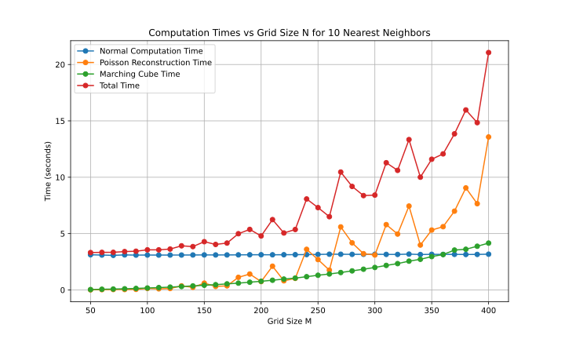
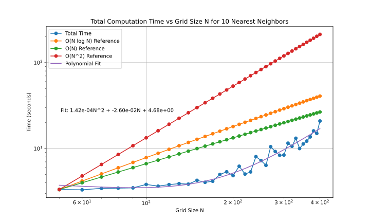
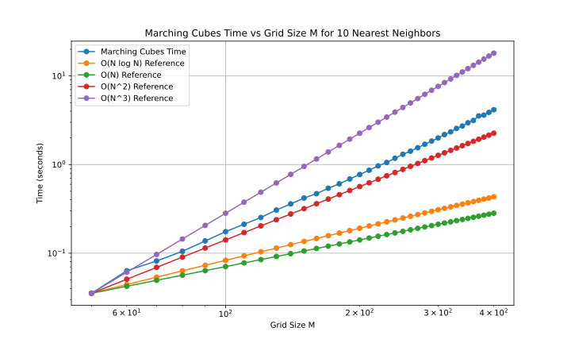

# POISSON SURFACE RECONSTRUCTION

**Authors:** Lionel Peduzzi, Myrine Msallem, Igor Grégoire


## Overview

This project's goal is the reconstruct a continuous, watertight surface from a discrete set of points. 
The Poisson Surface Reconstruction method provides
a global, smooth and robust solution based on solving a Poisson equation that integrates the normal field
of an oriented point cloud.

## Project Structure

```
.
├── data/          
│   ├── bunny.ply          # Sample point dataset
│   └── PLYgen.py          # Generates simple PLY file      
├── marchingCubes/         
│   ├── MC.py              # [NOT USED] Python implementation of marching cubes algorithm
│   └── triangleTable.py   # [NOT USED] Triangles table for the python implementation
│   ├── Mcc.c              # C implementation of marching cubes algorithm
│   └── Mcc.h              # Headers for the C implementation
├── plots/         
│   ├── plotTimes.py       # Python code to plot the averaged execution times
│   └── [plots].svg        # Plots
├── output/                # Output folder for the surface
├── shared_lib/            # Python-C binding files
├── poisson.py                # [MAIN] File to execute
├── poisson_solver.py             # Python file containing the vector field construction and the resolution of Poisson
├── time.zsh               # ZSH code file used to retrieve execution times
└── vector_field.c         # C file containing the vector field construction
```

## Usage
### ⚠️ Important Note for Cross-Platform Usage

**<span style="color: red;">If you use different Operating Systems, you need to change line 12 in `poisson_solver.py` and line 20 in `poisson.py`</span>**

### Binding the C-files
Bind the C-files with python to execute the code.


- For MacOS:
```gcc
gcc -shared -o shared_lib/vector_field.so -fPIC -O3 vector_field.c
gcc -shared -o shared_lib/Mcc.so -fPIC ./marchingCubes/Mcc.c -O3  
```
- For Linux:
```gcc
gcc -shared -o shared_lib/vector_field.so -fPIC -O3 vector_field.c
gcc -shared -o shared_lib/Mcc.so -fPIC ./marchingCubes/Mcc.c -O3  
```

- For Windows:
```gcc
gcc -shared -o shared_lib/vector_field.dll -fPIC -O3 vector_field.c
gcc -shared -o shared_lib/Mcc.dll -fPIC ./marchingCubes/Mcc.c -O3  
```

### Running Surface reconstruction

```python
python main.py -i <input_file> -o <output_file> -N <int> -k <int> -skfmm <0 or 1>
```
- `-i`: Input file path
- `-o`: Output file path
- `-M`: Grid size (MxMxM)
- `-N`: Number of closest neighbours to take account for the spatial research knn-tree
- `-skfmm`: Boolean, utilisation of skfmm for the construction of the iso-surface. Might have negative impact on the execution time.

## Algorithm

### Computing the normals
1. Build a knn-graph with the points.
2. Compute the PCA for each point using the k closest neighbours.
3. Compute the normal by taking the eigenvector associated with the smallest eigenvalue.
4. Weight the graph edges:  $W_{i,j} = n_{i} \cdot n_{j}$.
5. Compute the minimum spanning tree.
6. Orient the normals by propagating a normal chosen arbitrarily to its neighbours.

### Solve the Poisson equation
1. Compute parameter sigma that will be used in the Gaussian splatting of the normals (Sometime, a more suitable surface can be achieved by manually adjusting this parameter).
1. Propagate the normals by using Gaussian splatting on a regular grid to get a continuous vector field.
2. Compute the divergence of this vector field using  finite-difference approximation.
3. Solve the Poisson equation $\Delta^2\chi=\nabla \cdot V$ using spectral method, FFT (for more details see [Spectral method](https://en.wikipedia.org/wiki/Spectral_method)).

### Marching Cubes
1. Refit chi between 0 and 1.
2. Recover the isosurface $\chi=0.5$ with the marching cubes algorithm (Sometime, a more suitable surface can be achieved by manually adjusting the threshold of 0.5).


## Complexity

### Execution time repartition


### Total execution time complexity


### Marching cubes complexity



## Task's done by members
- **Igor** :
    - Compute and orient the normals.
    - Helped on solving poisson equation.
    - Helped on implementing marching cubes.
    - Time complexity analysis.

- **Myrine** : 
    - Computation of the sigma used in the gaussian splatting.
    - Implementation of marching cubes algorithm.

- **Lionel** : 
    - Compute the vector field.
    - Solve the Poisson equation.
